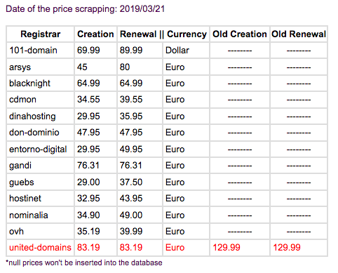

This repository contains the code for the registrar price scrapper, a tool that is used to automatically check the websites of several accredited registrars for .EUS and extract their creation and renewal prices. This way, that processed can be scheduled periodically and there is no need to check those registrars' website one by one. It will also highlight the changes in the prices so that updating them is easier, and that process can also be automatically executed too.

This tool will scrap each website and it will extract the price for whichever TLD you want. By default it has been implemented for scrapping prices for the .EUS domain, but with a few changes (mainly regarding the information in Domains.json) it can be adapted for another TLD. Up to now the system is prepared for the accredited registrars of the .EUS domains, but more registrars can be added. If you would like to know more about that process, you can read section *Domains.json*, and if you have any doubts we can assist you too.

The aim of publishing this publicly is to give access to other registries to this tool, so that they can use it for their own purposes. By default, when executed it will print the results of the scrapping, and it will also send the results by e-mail. Feel free to make any changes so that it adapts to your needs.

# Table of contents

- [Dependencies](#dependencies)
- [Main files](#main-files)
  * [Index.php](#indexphp)
  * [Scrapper.php](#scrapperphp)
    + [formatPrice](#formatprice)
    + [detectCurrency](#detectcurrency)
    + [readJson](#readjson)
    + [rndChar](#rndchar)
    + [removeVat](#removevat)
    + [prettyPrint](#prettyprint)
    + [generatePriceTable](#generatepricetable)
    + [generateCommandCasperjs](#generatecommandcasperjs)
    + [sendMessage](#sendmessage)
    + [scrapper](#scrapper)
    + [runSqlQuery](#runsqlquery)
    + [runSqlQueryArray](#runsqlqueryarray)
  * [Dinahosting.php](#dinahostingphp)
  * [Domains.json](#domainsjson)
  * [Default.js](#defaultjs)

# Dependencies
- [Phantomjs](http://phantomjs.org/):
This is a scriptable web browser that allows PHP to get the HTML code from a website after the javascripts have changed it. It is easy to script and it is also very light-weight. Sadly not all websites work with this tool, but this where CasperJS comes.

- [Casperjs](http://casperjs.org/index.html):
CasperJS uses PhantomJS and it is capable of navigating through websites as a headless browser. This tool allows directly to extract the prices from a website with javascripts and it is possible to click, scroll and do other things that PhantomJS cannot.

- [Pdf2htmlEx](https://github.com/coolwanglu/pdf2htmlEX):
This tool is capable of converting a pdf into an html that then can be read by CasperJS, which will extract the prices. This is necessary because some registrars don’t have all of their prices in the website and are only available in a pdf file. 
>**Note**: Pdf2htmlEX is not under active development anymore, so if you need to have the functionality to scrap prices from pdf files, you should look the OS versions Pdf2htmlEx is available in and make sure you are using a supported OS version. If you do not require to read from pdf files, you can remove folder *pdf2htmlEx* and its contents, as well as the relevant code in file *index.php* in the root folder

- [Phpmailer](https://github.com/PHPMailer/PHPMailer):
After scrapping the prices this tool allows the script to send the updated prices via email using SMTP in a very easy way and it is very easy to use.

# Main files

## Index.php
This is the main file of the program. At the beginning inside the style tags it is defined how the table will be printed on screen. After that comes the configuration part, this has to be set to work on different configurations.
The time zone has to be set because it is used to display the time of scrapping when sending the email and when printing the data to the screen. The max execution time has been raised to 250 since converting a pdf to html sometimes would surpass de default value and cause issues.
This is followed by the configuration of the database. To be able to successfully connect to the database it’s necessary to provide the *host*, *username*, *password*, *name of the database* and the *port*. 

After this comes the configuration of the PHPMailer. This is required to be able to send the results via email. The data is: 
- SMTPDebug (Integer ranging from 0 to 2)
  1. Off
  2. Client messages
  3. Client and server messages
- Host (hostname of the mail server)
- Port (587 for authenticated TLS)
- Port encryption
  + tls
  + ssl (deprecated)
- SMTP authentication (Boolean value)
- Username (Username for SMTP authentication)
- Password (Password for SMTP authentication)
- Address (Set who the message is to be sent from)
- emailSubject
- to (Recipient of the email)
- subject
- attached files (optional)
- message

The message is set with the prices after they have been scrapped.

To be able to use CasperJS it is necessary to put the path of PhantomJS and CasperJS in the system environment. The program detects whether the program is being executed from a Linux or Windows machine and configures it accordingly.

Besides, the configuration information for the database and the SMTP server has also need to be defined with your data.

## Scrapper.php
#### formatPrice
Receives an array with prices from which to extract from and to format. Removes any unnecessary characters such as letters and currency signs (including spaces) and converts all the ‘,’ into ‘.’. It sends these prices to detectCurrency(), and the prices are returned with their currency included in an array. 

Example:
- Receives: [0] Register: 65,55€, [1] Renew: 79,99€
- Returns: [0] 65.55, [1] 79.99, [2] Euro

#### detectCurrency
Takes an array of prices as string. The function loops through the prices until it finds a currency symbol of “€”, “EUR”, “£”, “GBP”, “$” or “USD”. If none found “Other”, it will be returned instead. 

Example:
- Receives: [0] 129, [1] $129
- Returns: “Dollar”

#### readJson
Takes the path of a json file (by default this file is domains.json), gets the contents, decodes it and returns the contents in an array. If an identifier is provided, the function returns everything inside the identifier.

#### rndChar
Generates random characters within the minimum and maximum, and the length desired passed as a parameter. Used to generate random URL queries

#### removeVat
Receives a price and the vat value to remove as an integers. The vat must be a percentage (Example: for 21% vat=21 and not vat=0.21). The output is the price as a float with two decimals and the decimal point is ‘.’.

#### prettyPrint
This is a debugging function. It takes an array as argument and prints it in a more readable form.

#### generatePriceTable
Takes a bi-dimensional array with all the extracted prices with the registrar name and currencies. The information is then converted into a table that contains said information and the old prices. If the new price is different to the previous one in the database the row will be displayed in red and only the changed price in the old rows will be displayed. The unchanged old prices will be displayed as a row with hyphens.

Example:

|Registrar|Creation|Renewal|Currency|Old creation|Old renewal|
|-----|-----|-----|----|----|----|
|101-domain|69.99|89.99|Dollar|-----|-----|
|**arsys**|**45**|**80**|**Euro**|**-----**|**85**|

#### generateCommandCasperjs
It creates a command to run in the terminal and execute CasperJS with the required information to scrap the website desired. By default it uses the javascript file default.js which takes a URL and XPaths followed by spaces.

It is also possible to generate a website query and then extract the prices from there.

For more information about how to format head to the [documentation of CasperJS](http://docs.casperjs.org/en/latest/index.html)

#### sendMessage
It uses the PHPMailer library to send an email to the desired user. The options for the mailer are sent in a Mailer object.

#### scrapper
This function goes through an array extracted from the domains.json file with the registrars from which to scrap the data. It validates the data from the json file and sets the default values if something is missing. In the case that this is not possible it will throw an exception.

Then it uses generateCommandCasperjs() to generate the command with the data from the json to execute. If there is an issue while CasperJS is running it will retry 3 times before it stops. After that using formatPrice() it format the prices so that the database can read the data. Before returning the price the VAT is removed if it has been previously specified in the json file. After that everything is put in an array and returned.

Example:

`Array
(
    [0] => 101-domain
    [1] => 69.99
    [2] => 89.99
    [3] => Dollar
)`

#### runSqlQuery
Takes a query as string and runs it in the provided database. It returns the output of the database.

#### runSqlQueryArray
Takes an array of queries as argument and runs each one of the queries. The returned output from the database are stored in an array. The values could be whether if the query was successful or the selected data.

## Dinahosting.php
If you would like to extract the prices of Dinahosting, you will have to request an API key and include your credentials in this file. An API credential can be acquired through Dinahosting's techical support service, provided that you already have created a user account in their website.

## Domains.json
This file contains all the information of the registrars and options when extracting the prices.

The root tag is called registrar and it cannot be removed or skipped. Inside it there is the name of the registrar, this is a string and is required. It is followed by the URL, this is also a string and it specifies the URL from which the program will scrap the prices and it is also required.

The next tag is url_query and this is used to tell the program that the URL is a query. Example: registrar.com/?query=dsakl.eus

This tag is not necessary but if url_query is set then the domain has also have to be defined. This is the domain used in the query. Example: registrar.com/?query=dsakl.eus

The VAT is an optional tag which defines if the price needs to have the vat removed. The value of the tag is an integer from 0 to 100 (the percentage without the ‘%’ character). If nothing is set or the value is 0, the price will remain unchanged.

The js_script tag defines a different javascript file to be used with CasperJS. This is used instead of the default default.js. This file has to be located inside the folder “js”. The tag has to contain the name and format of the file. Example: custom.js 

The tag XPath has two children: Registration and renew. This tag is necessary so the program knows where to search for the prices. Each one is a string containing the XPath of both prices. Getting the XPath can be done using most browsers by inspecting the element (right clicking and the pressing “inspect”, or by pressing F12 and then selecting the element), right click on the element -> copy -> Copy XPath or copy -> Copy selector.

Sometimes the XPath in the browser and in CasperJS will be different, if this is the case run getHTMLSource.js. This can be done via the terminal by writing “casperjs path_to_the_index.php/js/getHTMLSource.js url_of_the_website” (replace the text in bold). Copy the output to a text file with the name index.html and run it with a browser. After this repeat the previous steps.

There are browser extensions that can generate XPaths but sometimes they can cause problems if they are too long. When putting the XPath make sure that all the single quotation marks are replaced with \” so that php does not ignore them.

The currency is a string that sets the currency manually because sometimes the price returned from the XPath does not contain any information besides the price itself.

- registrar
  - name
  - url
  - url_query
  - domain
  - vat
  - js_script
  - XPath
    - registration
    - renew
  - currency
  
## Default.js
It is the default script that CasperJS uses to scrap the prices. The script can receive multiple arguments, the first one always being the URL and being followed with the register and renew price XPaths. The user can also pass –silent=true to avoid the script from outputting anything to the screen.

The script does not load any images or NPAPI plugins such as (Flash, Silverlight, ...) to speed up the process of scrapping.

The script uses a random user agent each time is run to avoid web pages blocking CasperJS. Casper is configured to run in 1920x1080 so that it does not detect the program as a mobile and resize the screen, changing the HTML. This would make the XPaths not work since it would not look like in the browser. Since we are not taking screenshots of the webpage, this should not cause any issues.

Then it proceeds to open the website and go through it with the provided XPaths and remove any spaces before sending it to PHP.
